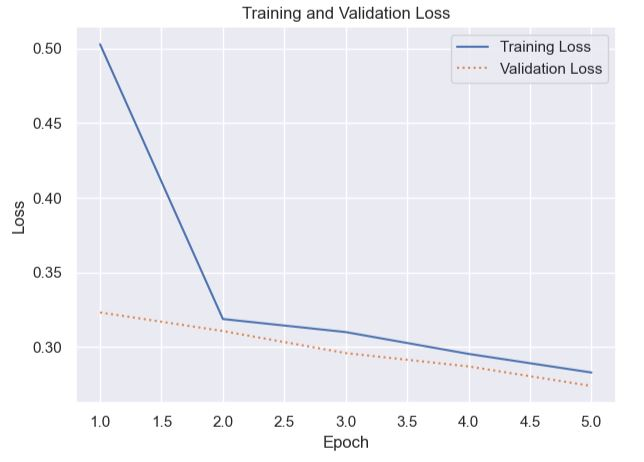
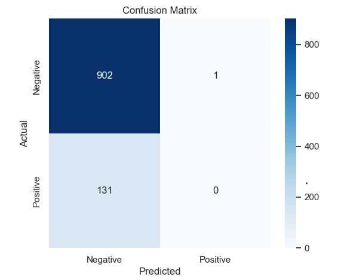
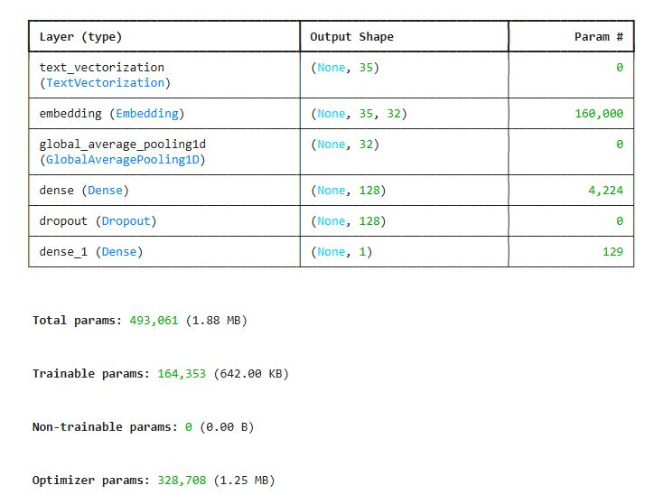

# SMS Spam Detection Using Deep Learning (Neural Networks)

## Project Overview

This project implements an **end-to-end SMS spam detection system** using **deep learning and natural language processing (NLP)** techniques. The system automatically classifies text messages as **Spam** or **Ham (legitimate)**, helping to reduce unsolicited messages and improve communication reliability.

The project explores and compares **multiple neural network architectures**, including a **Recurrent Neural Network (LSTM)** and a **feedforward neural network with text vectorization**, to identify the most effective approach for text classification.

---

## Project Objectives

* Clean and preprocess raw SMS text data for modeling
* Transform textual data into numerical representations using tokenization and embeddings
* Build and train deep learning models for binary text classification
* Evaluate models using accuracy, precision, recall, F1-score, and confusion matrices
* Compare different neural network approaches and analyze performance trade-offs
* Deliver a robust, scalable spam detection solution suitable for real-world deployment

---

## Technologies & Tools

* **Python**
* **Pandas, NumPy**
* **TensorFlow / Keras**
* **Scikit-learn**
* **Matplotlib, Seaborn**
* **Natural Language Processing (NLP)**

---

## 📂 Dataset

* **Source:** SMS Spam Collection Dataset
* **Size:** 5,169 messages after cleaning
* **Classes:**

  * `0` → Ham (Legitimate messages)
  * `1` → Spam

Duplicate messages were removed to ensure data quality and avoid bias.

---

## Data Preprocessing

* Removed redundant and unused columns
* Encoded target labels using `LabelEncoder`
* Eliminated duplicate records
* Tokenized text and applied sequence padding
* Limited vocabulary size to reduce noise and improve performance

---

## Model Architectures

### 1. LSTM-Based Recurrent Neural Network

* **Embedding Layer** for semantic word representation
* **LSTM Layer** to capture sequential dependencies in text
* **Sigmoid Output Layer** for binary classification

This model effectively captures contextual relationships within messages.

---

### 2. Feedforward Neural Network with Text Vectorization

* **TextVectorization Layer** for built-in tokenization
* **Embedding Layer**
* **Global Average Pooling**
* **Dense Layers with Dropout** for regularization

This architecture offers simplicity and faster training but lower expressive power.

---

## 📊 Model Performance

### LSTM Model Results

* **Test Accuracy:** ~98%
* **Spam Precision:** 98%
* **Spam Recall:** 88%
* **F1-Score (Spam):** 93%

The LSTM model demonstrated **strong generalization** and reliable spam detection.

---

### Feedforward Neural Network Results

* **Validation Accuracy:** ~87%
* Showed signs of **class imbalance bias**
* Lower recall for the minority class

This highlights the importance of evaluating beyond accuracy alone.

---

## 📊 Visualizations Explained

### Training vs Validation Accuracy

Shows consistent learning across epochs with minimal overfitting, indicating strong generalization.

---

### Training vs Validation Loss

Demonstrates effective loss minimization and stable convergence during training.

---

### Confusion Matrix

Provides insight into correct and incorrect classifications, highlighting class imbalance effects and prediction bias.

---

### Model Summary

Displays network depth, layer types, and parameter counts, offering transparency into model complexity.

---

## Key Insights

* LSTM-based models outperform simpler neural networks for text classification tasks
* Sequential context is critical for detecting spam patterns
* Accuracy alone can be misleading in imbalanced datasets
* Proper preprocessing significantly improves model performance

---

## Recommendations

* Deploy the **LSTM model** for production-grade spam detection
* Apply **class weighting or resampling** to address class imbalance
* Experiment with **pretrained embeddings** (GloVe, FastText) for improved semantics
* Implement **early stopping** and hyperparameter tuning
* Extend the model to **email spam detection or multilingual datasets**

---

## Future Enhancements

* Real-time inference API using **FastAPI**
* Model deployment with **Docker**
* Stream processing with **Kafka**
* Monitoring model drift in production

---

## 🧑‍💻 Author

**Gogo Isaac Harrison**
*Data Analyst | Machine Learning Enthusiast*

Feel free to connect or contribute!

---
